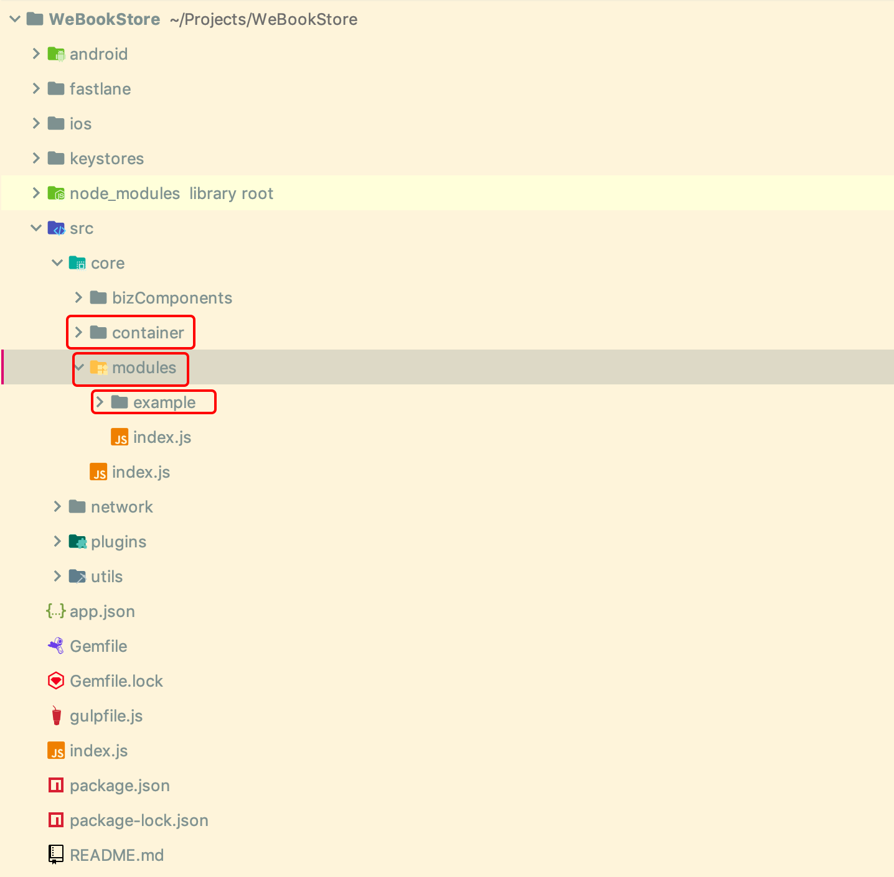
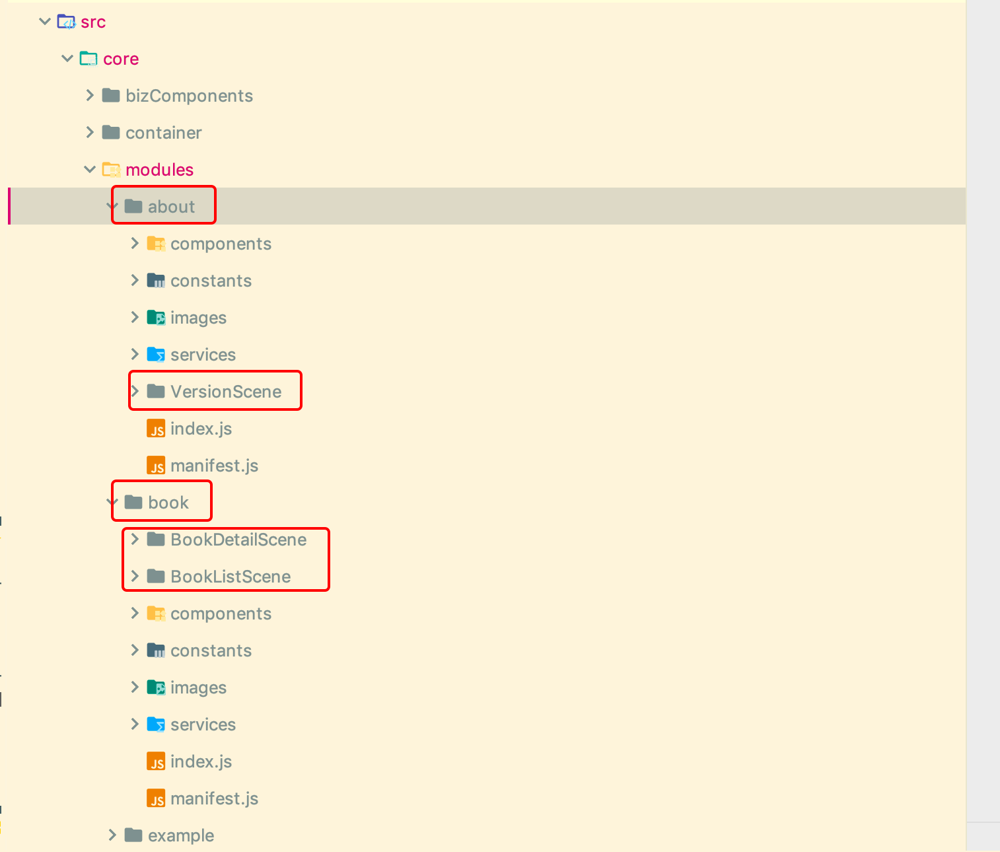

## Trident的目标
一套可快速开发支持商业运营App的框架。

## Trident的开发背景
很多开发者会发现开发完成一套App，仅仅开发业务功能可以很快，但是开发完以后，为了配合运营，需要开发很多额外的功能，这些功能是有一定共性的。除此之外，开发团队变大以后为了能让开发团队协作，又需要对整体架构做重新的设计以适应各个模块同时迭代开发的需求。

Trident就是为解决这两个问题而生的，Trident在设计初期就考虑了后续的各种正式运营的需求，而且明确的做了垂直的分层和水平的分模块，实现了模块内高内聚、模块间低偶合。

## 快速开始
在开始之前为了避免各种网络问题，行内用户可以如下配置代理，并且使用Office-WiFi。
1. 在`~/.npmrc`中配置代理
    ```
    proxy = http://proxy.webank.com:8080
    noproxy = wnpm.weoa.com,10.107.103.115
    ```
2. 在`~/.gitconfig`中配置代理
    ```
    [http]
    proxy = http://proxy.webank.com:8080
    sslverify = false
    [https]
    proxy = http://proxy.webank.com:8080
    sslverify = false
    [url "http://github.com/"]
    insteadOf = git://github.com/
    ```


为了快速的理解Trident的使用，我们从一个简单应用开始，逐步的说明各种用法和设计思路。

今天我们来开发一个简单的图书管理App，App的交互设计如下：


### 前期准备
开始之前我们先确定
- App名称: WeBookStore
- App BundleId(Android上的packageName): com.trident.wbstore
- App schema: wbstore


### 创建项目
首先确保已经安装了npm。

#### 1. 安装trident-cli
``` shell 
wnpm install -g @webank/trident-cli
```

#### 2. 用trident-cli 创建项目
``` shell 
trident-cli init --name=WeBookStore --bundleId=com.trident.wbstore
```
根据命令提示生成输入schema `wbstore` 

等待所有依赖安装完成即可。

#### 3. 启动应用(iOS)
``` shell 
cd WeBookStore
# 在XCode中打开项目
open ios/WeBookStore
# 启动react native packager
npm run start
```
在XCode中Run即可。

恭喜你，到这里你已经成功到创建并运行了一个新的Trident工程。

#### 4. 启动应用(Android)
用Android Studio打开项目运行即可

# 代码结构和模版工具
## App脚手架介绍
上面的过程生成了Trident App最基础的结构，生成的项目结构如下: 


Trident App把App的结构分为三层： `全局容器 -> 模块 -> 页面(我们称之为Scene)`。
- `container`即为全局容器，所有App全局需要的一些逻辑都在这个模块，这个模块产生的数据也供全局共享。
- `modules` 该目录下面是App的业务模块，通过命令创建的业务模块都会存放在这里。
- `example` 该目录是初始生成的demo目录，表示一个业务模块，该模块的所有Scene均在此目录下。

## 业务模块的划分
这一部分我们介绍Trident的模块和页面划分机制，并且介绍如何我创建它们。
WeBookStore到页面我们按业务功能分类分为两部分，一部分是书籍相关的我们暂且命名为 `book`，关于我们的页面我们单独新建一个模块叫 `about`，这里的模块划分没有严格的限制，可以根据每个App自身的逻辑关联关系来划分，可以根据业务流程和每个页面的数据共享关系来划分。
确定了模块以后我们按业务规划我们的页面则有如下计划

```
book 
    BookListScene // 书籍列表页
    BookDetailScene // 书籍详情页
about
    VersionScene // 版本信息页
```

## 生成模块 && Scene
``` shell
trident-cli gen module
# 1. 根据提示输入模块名称 book
# 2. 根据提示输入BookListScene
# 3. 根据提示输入BookDetailScene

trident-cli gen module
# 1. 根据提示输入模块名称 about
# 2. 根据提示输入VersionScene
```
到这里几个页面已经生成完成。打开项目可以看到对应的模块和页面已经生成。


PS: 此时我们可以移除测试模块 `example` 了，移除一个模块非常简单，在`modules/index.js` 中删除对应模块的`require`并且删除目录即可。此时我们刷新App进入的第一个页面已经是 BookListScene 了。

# 路由控制
主要的页面已经生成，可能你已经迫不及待的想试一下让页面串联起来。在Trident App中你可以非常轻松的通过模块名和页面名进行跳转。通过 AppNavigator.$moduleName.$sceneName()即可完成跳转。
## 普通跳转
按上面规则，可以改写BookListScene如下，完成到BookDetailScene的跳转。

```jsx
// modules/book/BookListScene/BookListScene.js

/**
 * 负责用户交互逻辑
 *
 * Created by erichua on 2019-06-02T16:07:03.705Z.
 */
import React, { Component } from 'react'
import { View, Text } from 'react-native'
import { AppNavigator } from '@webank/trident'
import { WeTouchable } from '@unpourtous/react-native-touchable'

export default class BookListScene extends Component {
  static navigationOptions = ({ navigation: { state: { params = {} } } }) => ({
    headerTitle: params.title || 'BookListScene'
  })

  render () {
    return (
      <View>
        <Text>Hello BookListScene</Text>

        <WeTouchable onPress={() => {
          AppNavigator.book.BookDetailScene()
        }}>
          <Text>Navigate to Book Detail</Text>
        </WeTouchable>
      </View>
    )
  }
}

```

## 带参数跳转
上面显示的是一种非常普通的跳转情况，那如果我们需要带参数跳到下个页面如何携带并在下一个页面获取呢？下面展示如何使用跳转参数： 

``` js 
// BookListScene render
  render () {
    return (
      <View>
        <Text>Hello BookListScene</Text>

        <WeTouchable onPress={() => {
          AppNavigator.book.BookDetailScene({
            bookId: 'a_cool_book'
          })
        }}>
          <Text>Navigate to Book Detail</Text>
        </WeTouchable>
      </View>
    )
  }
```

``` js
// BookDetailScene.js render
  render () {
    return (
      <View>
        {/* ... */}
        <Text>BookId: {this.params.bookId}</Text>
      </View>
    )
  }
```

## 生命周期
相比react component的生命周期，trident提供的生命周期更容易使用，我们用onResume和onPause分别来表示对应页面状态都变化。其中融合了页面创建，页面恢复，App整体前后台切换。
### onResume 
在每个页面首次进入和恢复的时候都会调用，比 componentDidMount特别的是，在App切换到后台切回来以及Trident的页面切会到该页时也会调用。

### onPause 
在每个页面离开会调用，比 componentWillUnMount特别的是，在App切换到后台也会调用。

### 特别说明
Trident的生命周期不影响 react component、react-navigation、AppState提供的生命周期，如果需要更为精细的控制可以考虑使用她们。


# 数据状态管理
前面我们已经让几个页面串联起来了，接着我们讨论数据状态大管理我，Trident中通过redux来做数据状态的管理。并且设计了一套固定的数据状态隔离和共享的方案来解决redux store上数据管理混乱的问题。

如果没有使用过redux，建议先阅读redux官方文档。
## 数据的隔离和共享
redux提供来足够的数据共享能力，但是所有数据在一个store上，既提供了方便，又带来了危害，redux的可以算做是一个全局变量，虽然通过固定的数据流来维护数据，但是始终无法完全摆脱全局变量多处共同维护和使用一份数据导致的问题。想象一下，如果整个App有上百个页面，所有共享数据均无规则存储在store上，那将会是一番如何混乱的景象。

因此在Trident的对store上的数据结构和层次做了明确的区分，与我们的目录结构类似，store上的数据结构也分为了三层：global、modulePrivate和scene。

global为全局共享数据，这些数据可以供所有模块的页面读取，维护这些数据对应的action也可供所有模块的页面使用用于更新数据。

modulePrivate为模块内私有数据，这些数据仅仅可以在同一个模块内的页面间共享，维护这些数据对应的action也只可以在这个模块内的页面访问。

scene级别的数据为页面私有数据，其他页面无法共享。

通过上述层次划分，使用过程中，按 scene -> modulePrivate -> global的顺序去存放数据，尽可能控制数据的访问范围。

PS: 可能有人会质疑scene这一级的数据的必要性，因为看起来可以用this.state 替代，Trident单独设计scene级别的数据在store上存储主要考虑数据统一管理的便利性。

具体使用示例下一个部分一起详述。

# 使用网络
Trident 推荐将服务器端的API统一管理，相比于把api接口直接零散的写入代码，配置的方式可以为后续针对接口的数据分析提供诸多便利。Trident中网络的配置如下: 

``` js
// modules/book/cgi/index.js
export default {
  requestBookList: {
    baseURL: 'https://www.mocky.io/',
    url: '/v2/5cedf70f300000bd1f6e97fd',
    desc: '请求书籍列表',
  }
}
```
要使用此接口也非常简单，我们在BookListScene中使用此接口。
``` js
// modules/book/BookListScene/BookListScene.js
export default class BookListScene extends Component {
  // ...
  componentDidMount () {
    // 请求
    APIClient.request(CGI.requestBookList, {
      start: 0,
      pageSize: 10
    }).then(response => {
      console.log(response)
    }, error => {
      console.warning(error)
    })
  }
```

前面我们提到数据状态的管理，这里我们可以将接口返回数据放到scene对应的数据区中，可以直接调用`setSceneState` 方法： 
``` js
  // modules/book/BookListScene/BookListScene.js
  componentDidMount () {
    // 请求
    APIClient.request(CGI.requestBookList, {
      start: 0,
      pageSize: 10
    }).then(response => {
      this.setSceneState({
        bookList: response
      })
    }, error => {
      console.warning(error)
    })
  }
```

我们要获取到这个数据只需要从 `this.props` 上获取即可 `bookList`: 

``` js
// modules/book/BookListScene/BookListScene.js
  render () {
    return (
      <View>
        {(this.props.bookList || []).forEach(bookInfo => {
          return <BookListItem bookInfo={bookInfo} />
        })}
      </View>
    )
  }
```

## Cookie使用
TODO 

## 配置说明
## Mock的配置
TODO 

# 界面开发 
## trident-ui


# 构建和发布
Trident App的发布依赖fastlane，并且已经集成了最常用的一些插件。
## iOS发布
``` shell 
bundle exec fastlane ios release --verbose
```
## Android发布
Android发布请先生情自己的发布keystore，不要使用示例中的 `keystores/demo-release-keystore` 做正式发布。可替换`keystores/demo-release-keystore`为自己的keystore路径并配套的设置密码和别名以及别名密码，然后运行如下命令: 
``` shell
bundle exec fastlane android release --verbose
```
为了保证keystore的安全，不要把keystore放到代码库，这种情况可以考虑将keystore和对应的密码都放到外部通过环境变量传入给fastlane。

## 外部拉起支持
```shell
# iOS模拟schema拉起
xcrun simctl openurl booted wbstore:///example/DemoScene?title=TestSchemaJump
```

```shell
# Android模拟schema拉起
adb shell am start -W -a android.intent.action.VIEW -d wbstore:///example/DemoScene?title=TestSchemaJump com.trident.wbstore
```

# 调试
## 日志系统介绍
// TODO 日志颜色截图说明
// TODO 日志图标说明

## 性能监控介绍
// TODO 


# 使用业务插件
业务差价是别人给予Trident的结构开发，可一键式接入到其他Trident App使用独立模块。
// TODO 

# 开发业务插件
