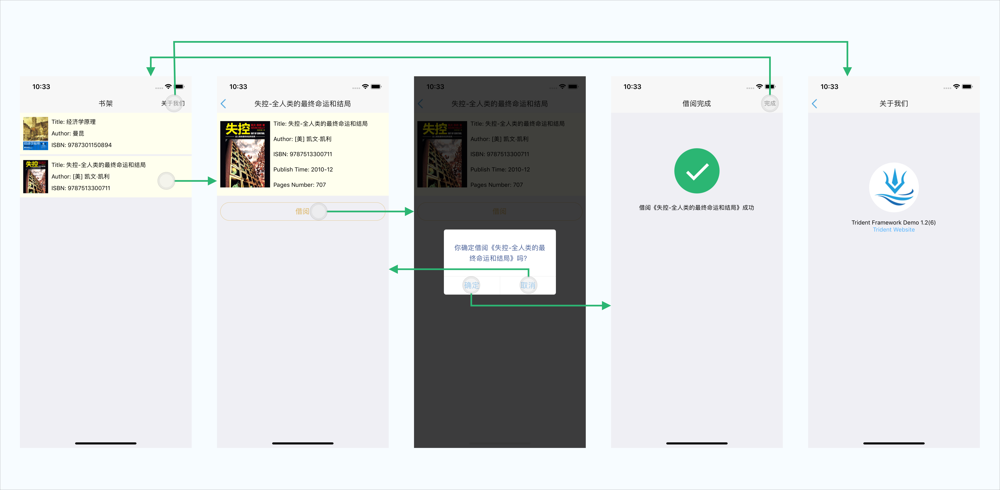

<br />

[](https://badge.fury.io/js/%40webank%2Ftrident)
[](https://travis-ci.org/WeBankFinTech/WeTrident)
[](https://nodejs.org/en/)
[](https://nodejs.org/en/)
[](https://git-scm.com/)
[](https://fastlane.tools/)
[](https://cocoapods.org/)

## WeTrident的目标

一站式金融App开发套件。

## WeTrident的开发背景

WeTrident由微众银行App团队开发。开发过程中我们调研了其他RN开发框架，发现大部分适合比较小的项目，或者是用到后期要真实运营时还需要补充很多运营相关的基础能力。要开发真正商业运营的App，需要很多打磨，用现有的框架无法做到快速地、高质量地开发。因为这些痛点，促使我们开发了WeTrident，希望在开发、运营、测试几方面提供更好的基础开发设施。

WeTrident的技术选型风格跟我们团队一致，稳健为第一要求，不盲目追求新技术，不炫技和随意地使用不稳定的技术方案。在跟进前沿技术和稳定实用之间，我们毫不犹豫会选择稳定实用。这也是WeTrident作为一套开发可商业运营的App框架的基础原则。如果你的团队也需要快速开发稳定高质量的产品，那WeTrident应该会成为你的选择。

## WeTrident给你提供了什么

1. **经过时间验证的技术栈**：省去你在选择尝试各种新技术时，耗费在填补各种坑上面的时间。
2. **合理的App架构设计**：在这套框架的约束下面，新人也可以快速地开发出高质量代码。
3. **全面的调试信息**：统一将请求、修改状态等操作的日志统一输出，提到调试效率。
4. **完善的构建和发布环境**：帮你避开各种构建环境的坑。

PS：WeTrident在设计过程中会增加一些限制，作为一套通用框架，我们深知应该留给使用者足够的扩展空间。所以我们在设计过程中尽可能的控制限制的数量，并且做到，**“框架增加一项限制，就至少给使用者带来一批好处”。**

## 开发环境依赖

WeTrident目前仅支持macOS操作系统。通过使用 `@webank/trident-cli` 初始化项目，如果有任何相关问题，WeTrident会提示出来以便协助你解决。开发前需要先配置Android和iOS开发环境，具体配置方法可以参考Android和iOS官方文档。

## Demo

- [WeTrident demo apk](https://github.com/WeBankFinTech/WeTrident/releases/download/untagged-717cba61f6eb59513bf7/WeTrident-1.0.2.apk)

## 创建项目

为了快速的理解WeTrident的使用，我们从一个简单应用开始，逐步的说明各种基础用法。整个讲解过程中一些UI细节实现不会详细描述，你可以通过阅读[快速入门](https://webankfintech.github.io/WeTrident/docs/getting-started)，来完成一个简单的图书管理App。

App的页面大致如下：



- App名称：WeBookStore
- App BundleId(Android上的packageName)：com.wetrident.wbstore
- App schema：wbstore

### 创建项目

#### 1. 安装trident-cli

``` shell
npm install -g @webank/trident-cli
```

#### 2. 用trident-cli 创建项目

``` shell
tdt init --name=WeBookStore --bundleId=com.wetrident.wbstore --scheme=wbstore --eslint
```

等待安装完成即可，如果需要自定义这些参数也可运行 `tdt init` 并根据命令行提示输入自定义参数即可。

PS：初始化过程中会对当前的开发环境做检查，如果有提示某些环境不满足，请先按照提示安装或者升级。

#### 3. 启动应用(iOS)

``` shell
cd WeBookStore

# 启动react native packager
tdt packager start

# 通过命令行启动App
tdt run ios 

# 也可以在XCode中打开项目, 在XCode中Run即可。
open ios/WeBookStore.xcworkspace/
```

#### 4. 启动应用(Android)

```shell
# 启动Packager，如果已经启动可以忽略
tdt packager start

# 通过命令行启动App
tdt run android

# 也可以在Android Studio中打开'WeBookStore/android', 
# 用Android Studio打开项目运行即可, 请确保gradle的代理配置已经如本文前面部分所述设置完成。
```

如果你的网络不好，连接maven失败，可以选择添加阿里云的maven镜像，在`WeBookStore/android/app/build.gradle`和`WeBookStore/android/build.gradle`中的 repositories 区域添加如下代码:

```
maven{ url'http://maven.aliyun.com/nexus/content/groups/public/' }
maven{ url'http://maven.aliyun.com/nexus/content/repositories/jcenter'}
maven{ url 'https://maven.google.com' }
```

恭喜你，到这里你已经成功的创建并运行了一个新的WeTrident工程。需要调试可以使用React Native官方调试工具，调试前请先安装最新版本Chrome。具体使用方法见： [React Native调试方法](https://facebook.github.io/react-native/docs/0.51/debugging)。

WeTrident的完整文档请访问：https://webankfintech.github.io/WeTrident

## Contributors
<div>
  <a href="https://github.com/erichua23"></a>
  <a href="https://github.com/rcrab"></a>
  <a href="https://github.com/lhtin"></a>
  <a href="https://github.com/yatessss"></a>
  <a href="https://github.com/AKB48"></a>
</div>

## 社区

| Github Issue | 微信群 |
| ------ | ------ |
| [WeBankFinTech/WeTrident/issues](https://github.com/WeBankFinTech/WeTrident/issues) |  |
