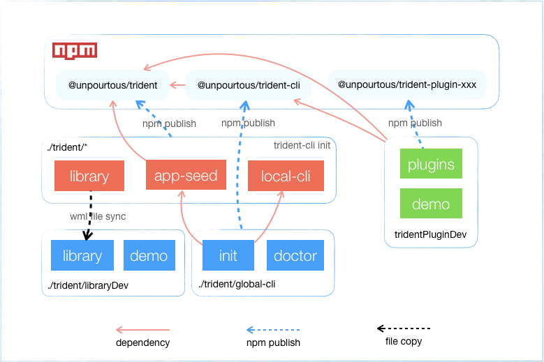

# Trident App Framework

## clone项目代码库
``` shell
git clone git@github.com:WeBankFinTech/WeTrident.git

cd WeTrident

# 安装开发需要的node版本, 请严格使用 `.nvmrc` 中标明的node版本进行开发
nvm install
```

## 基础结构说明


如上图所示，在我们开发过程中，经常会需要模拟发布到 npm registry来验证一些问题，但是每次发布外网npm显然不现实，所以我们可以使用 verdaccio 来搭建本地的npm registry，在开发过程中发布到 verdaccio。正式对外时再发布到npm。安装 verdaccio 后，需要修改npm的registry中的uplinks和packages，命令如下: 
```shell

```

verdaccio 顺利安装以后，通过下面命令可以将 `trident`和`trident-cli`发布到 verdaccio. 

```shell
npm run publishAll
```

如果需要更新 `trident-cli` 到最新版本，则只需要运行

```
npm run reinstallCli
```


## npm环境的切换
现在为了开发，需要在npm(对外发布前均指本地的 verdaccio)和wnpm(使用已经发布到wnpm的稳定版)之间切换.
可以使用命令行环境变量进行切换： 

```shell
# 切换为npm 
export npmClient=npm

# 切换为wnpm
export npmClient=wnpm
```

## 构建工具链开发
### global-cli
为了方便用户使用，专门开发了 @unpourtous/trident-cli 这个npm包，后面称为`global-cli`，主要用于承载初始化工具以及和local-cli桥接。因为考虑到global-cli会以npm全局模块的方式安装到用户开发环境，更新相比起来比较困难，global-cli中内容要尽可能少，只提供最必须带命令。可以理解为项目创建前需要的工具纳入到`glocal-cli`中，项目创建后要用到带工具命令放入到 local-cli 中，local-cli 中可以放其版本对应的特有命令，global-cli 必须放版本无关的命令。

#### init
初始化命令，在新建的工程目录生成package.json 并且安装 `@unpurtous/trident`，从 `@unpurtous/trident` 中复制 `app-seed` 用户生成新项目，并按用户输入的配置修改项目的元信息。创建前会去判断是否支持要求的 `npm` 版本。
### local-cli
项目生成后的命令都在这里面，包含代码模版

#### env check/setup
此命令用于在使用 trident 前检查当前开发环境缺少的依赖，

#### 调试本地命令
cli 在开发过程中需要进行调试，所以，必然会有需要用本地的global-cli调用本地的local-cli的情况，现在的脚本中已经支持了这种方式。需要调试cli脚本，只需要运行如下
```
export useLocal=true && ./global-cli/index.js init testProj
```

## app-seed更新

## 业务插件开发
业务模块插件的开发是Trident的一大特色，开发者可以将自己某个独立可公用带业务模块以`trident-plugin`的形式输出。其他用户只需要通过 trident-cli 安装此业务插件即可使用这个公用带业务能力，常见带业务插件有 trident-plugin-feedback，trient-plugin-in-app-browser，trident-plugin-version-manager等。


### 插件初始化

如果您希望开发一个插件给别人使用，需要在项目根目录下运行

```
$ tdt plugin init [moduleName]
```

`moduleName`即为需要发布为插件的模块，此命令将在模块目录下初始化`package.json`，并自动添加`README.md`，开发者可以在 README.md 中补充插件说明。

### 插件发布

插件开发完成需要发布，在项目根目录下运行

```
$ tdt plugin publish [moduleName]
```

`moduleName`即为需要发布为插件的模块，此命令将抽取插件依赖更新至`package.json`，引导开发者更新插件版本号，执行插件发布。

### 插件安装

```
$ tdt plugin add [pluginName]
```

## trident library开发
trident是一套开发方案，其中提供的核心能力均在 trident/library中实现，为了开发 library, 项目中有一个libraryDev工程，这个功能主要用于libraryDev的展示，libraryDev工程不会发布到npm，但是会在git库中管理，libraryDev像一个正常的trident工程一样依赖 `@unpurtous/trident`，唯一区别是在开发过程中我们会启动`wml`来将 trident/library 实时同步覆盖 `libraryDev/node_modules/@unpourtous/trident/library/`，如此可以方便的看到改动效果。`wml`的具体用法见 `https://github.com/wix/wml` 

```
// 将wml的src目录添加至 watch-list(注意替换你本地wml的目录)
watchman watch /Users/rcrabwu/.nvm/versions/node/v8.9.0/lib/node_modules/wml/src
watchman watch ./library
wml add library/ libraryDev/node_modules/@webank/trident/library/
wml start
```

## npm scripts VS gulp VS trident-cli
这三者可能某些开发者会觉得搞不清楚各自的应用范围。
1. npm scripts 用于开发库的过程。库开发者使用
1. gulp trident中有了cli的封装，暂时不需要使用gulp
2. trident-cli 应用开发者使用，包含应用开发过程中需要的指令


## 开发常用工具
```shell
# iOS模拟scheme拉起
xcrun simctl openurl booted trident-scheme:///example/DemoScene?title=TestSchemeJump
```

```shell
# Android模拟scheme拉起
adb shell am start -W -a android.intent.action.VIEW -d "trident-scheme:///example/DemoScene?title=TestSchemeJump" org.reactnative.example
```


## 文档发布说明
```shell
# 1. pack website

cd website
npm run pack-website

# 打包完成以后website的压缩包为./website/release/website.tgz
2. 发布到服务器 `/usr/share/nginx/html`，在服务器上运行如下命令上传文件，并解压到trident目录

rz
tar xzvf website.tgz -C trident

```

