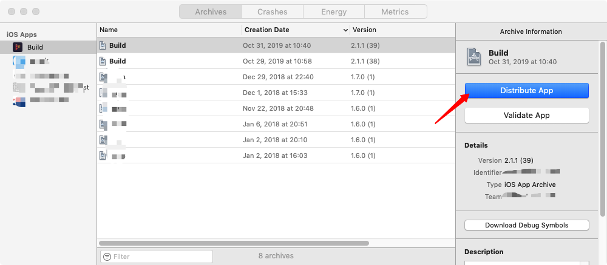
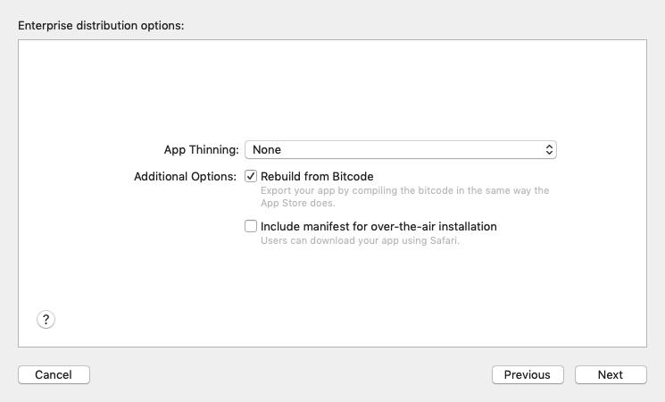
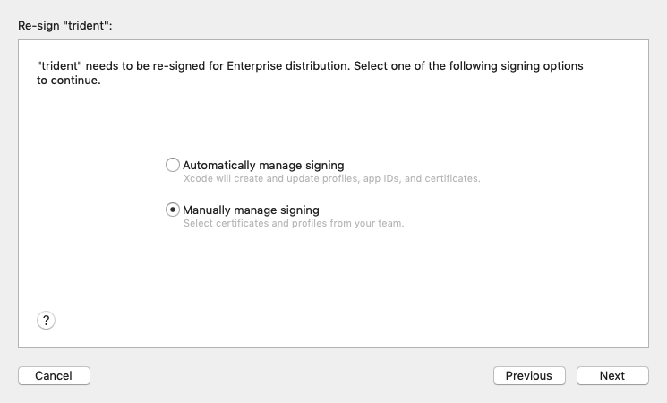
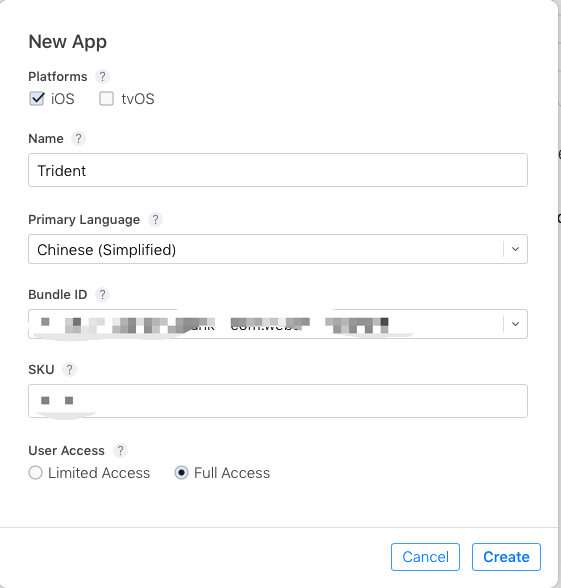
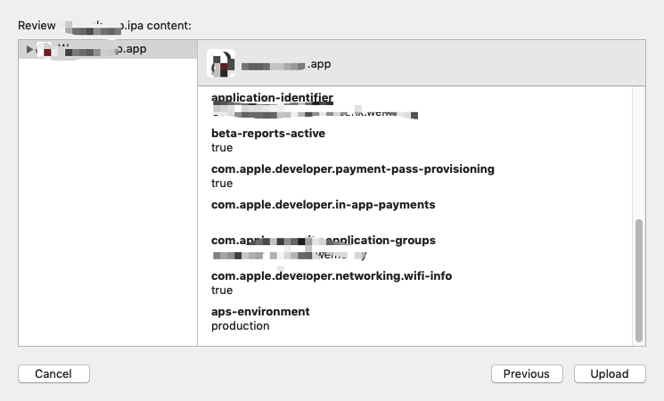

# iOS 发布参考

### 前提

完成 appid 与证书创建，可以参考此篇文章[苹果APPID和证书创建](https://www.jianshu.com/p/44e31512c42d)

## 1 企业分发

#### step 1

选择 `Xcode` -> `Window` -> `Organizer`

选中目标版本，点击`Distribute App`进行分发。

在弹出框选择`Enterprise`，进入下一步。

分发选项，默认即可，进入下一步

#### step 2

重新签名，可选择`Automatically manage signing`（自动签名）或`Manually manage signing`(手动签名)

下面以手动签名为例，进入下一步，选择企业分发证书与pp文件

#### step 3

选择好相应的证书和pp文件，进入最终编译，编译通过可选择导出

导出的目录中，`*.ipa`即可用于企业分发的 ipa 文件。

## 2 App Store 分发

#### step 1

> PS: 如已创建则跳过此步骤

登录 [App Store Connect](https://appstoreconnect.apple.com/login)，选择`My Apps`，点击左上角`+`进行创建App

其中SKU Number是一个唯一标识你的app的特殊字符串。应用发布之后就不能修改，可以使用app的Bundle ID。

#### step 2

选择 `Xcode` -> `Window` -> `Organizer`

选中目标版本，点击`Distribute App`进行分发

在弹出框选择`App Store Connect`，进入下一步

选择 ipa 最终输出位置 `Upload`或`Export`，下面以`Upload`为例。

#### step 3

Xcode 询问是否上传符号表以便接收来自苹果的crash等数据反馈，默认即可。

选择证书与pp文件，注意是 App Store Distribution 证书！

进入下一步

#### step 4

检视 App 信息

点击上传，等上传成功会有 Success 的提醒，点击 Done 即可。这时已经说明打包上传 App Store Connect 后台成功。

#### step 5

回到 App Store Connect -> 你的App -> 准备提交的版本 -> 选择一个构建版本。

然后按照需求把其他数据填写完毕就好（app名称，副标题，截图，预览视频等），最后点击 **提交以供审核**，等待苹果公司的审核，审核结果会通过邮件发送给开发者，开发者也可自行登录 App Store Connect 查看审核结果。