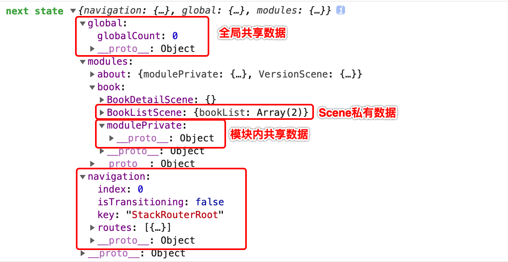

从网络上拉取到数据以后我们会把这些数据统一管理起来。 Trident中通过redux来做数据状态的管理。并且设计了一套固定的数据状态隔离和共享的方案来解决redux store上数据管理混乱的问题。

前面我们提到数据状态的管理，这里我们可以将接口返回数据放到scene对应的数据区中，可以直接调用`setSceneState` 方法： 


## 数据的隔离和共享
redux提供来足够的数据共享能力，但是所有数据在一个store上，既提供了方便，又带来了危害，redux的可以算做是一个全局变量，虽然通过固定的数据流来维护数据，但是始终无法完全摆脱全局变量多处共同维护和使用一份数据导致的问题。想象一下，如果整个App有上百个页面，所有共享数据均无规则存储在store上，那将会是一番如何混乱的景象。

因此在Trident的对store上的数据结构和层次做了明确的区分，与我们的目录结构类似，store上的数据结构也分为了三层：global、modulePrivate和scene。

global为全局共享数据，这些数据可以供所有模块的页面读取，维护这些数据对应的action也可供所有模块的页面使用用于更新数据。

modulePrivate为模块内私有数据，这些数据仅仅可以在同一个模块内的页面间共享，维护这些数据对应的action也只可以在这个模块内的页面访问。

scene级别的数据为页面私有数据，其他页面无法共享。

通过上述层次划分，使用过程中，按 scene -> modulePrivate -> global的顺序去存放数据，尽可能控制数据的访问范围。


## 存放数据到Scene数据区
``` js
  // modules/book/BookListScene/BookListScene.js
  componentDidMount () {
    // 请求
    APIClient.request(CGI.requestBookList, {
      start: 0,
      pageSize: 10
    }).then(response => {
      this.setSceneState({
        bookList: response
      })
    }, error => {
      console.warning(error)
    })
  }
```
调用完成可以看到日志如下，bookList更新到了新的`next state`上。

需要要`bookList`只需要从 BookListScene的`this.props` 上获取即可。

上面截图中我们可以看到整个App的state结构：


``` js
// modules/book/BookListScene/BookListScene.js
  render () {
    return (
      <View>
        {(this.props.bookList || []).forEach(bookInfo => {
          return <BookListItem bookInfo={bookInfo} />
        })}
      </View>
    )
  }
```

### 存放数据到 modulePrivate 区
`modulePrivate`的数据模块内私有，模块内的Scene可以共享这些数据。在我WeBookStore中，
考虑BookDetailScene中也会用到书籍列表数据，bookList 放到 BookListScene下是不够的，需要提升到`book` 模块的共享数据区。
要完成这个提升首先我们需要在module中增加一套action/reducer，然后将对应的数据绑定到使用数据的Scene即可。

```js
// WeBookStore/src/core/modules/book/index.js
export default {
  moduleName: 'book',
  initialState: {
    // moduleCount: 0
  },
  sceneList: require('./manifest').default,
  actions: {
    updateBookList: v => v
  },
  reducers: {
    updateBookList: (state, action) => ({ ...state, bookList: action.payload })
  }
}
```


```js
// WeBookStore/src/core/modules/book/BookListScene/index.js
export default (global, ModulePrivate) => ({
  // ...
  /**
   * 将module级别的共享数据映射到props
   */
  mapModuleState: state => ({
    bookList: state.bookList,
  }),
  /**
   * 将module级别的actions映射到props
   */
  moduleActions: {
    updateBookList: ModulePrivate.actions.updateBookList
  },
  // ...
})
```

修改 BookListScene 使用 updateBookList 更新模块数据
```js 
  // WeBookStore/src/core/modules/book/BookListScene/BookListScene.js
  async componentDidMount () {
    this.props.updateBookList(await BookListService.requestAllBookList())
  }
```
修改完成以后可以看到数据已经存放到 `book` 模块的`modulePrivate`上, 改完以后render内不用修改。


同样的在BookDetailScene中可以很容易的共享 `modulePrivate` 上的bookList。
```js
// WeBookStore/src/core/modules/book/BookDetailScene/index.js
export default (global, ModulePrivate) => ({
  // ...
  /**
   * 将module级别的共享数据映射到props
   */
  mapModuleState: state => ({
    bookList: state.bookList,
  }),
  /**
   * 将module级别的actions映射到props
   */
  moduleActions: {
    updateBookList: ModulePrivate.actions.updateBookList
  },
  // ...
})
```
