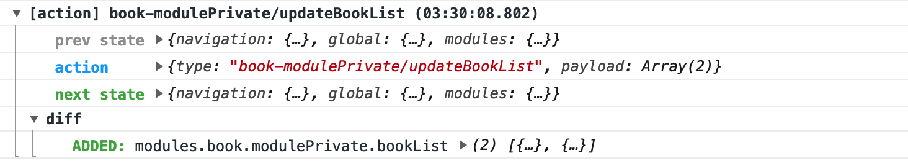

为了方便调试，WeTrident在Debug时默认会打印大量的日志，目前WeTrident打印的日志包含网络请求、页面跳转、Redux数据变化。日志相比于调试器的好处在于bug有迹可循。例如下面这张图是WeBookStore运行的日志。

## 状态数据的变化日志
整个App的redux action发出触发的数据变化都会被打印出来，具体打印效果如下： 

## 网络请求响应日志
 - 每个网络请求都会打印请求的配置。
 - 每个网络返回的内容也会打印
 - 用颜色区分请求返回的三种情况，mock返回、cache返回和真实返回，示例如下： 
 
 
## 页面切换日志
这部分日志主要是页面切换和生命周期的日志，例如下面的这些： 

